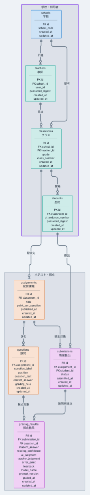
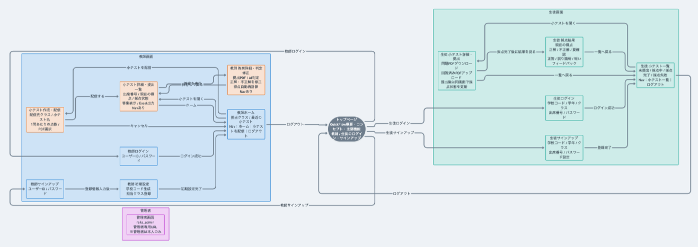

# QuickFlow

## アプリケーション概要

QuickFlowは、中学校数学教師を対象に、授業内で実施する「式の計算」の小テストにおける採点・得点計算・成績処理の業務負担を軽減するとともに、生徒へ採点結果を速やかに返すことで、学習の振り返りを支援する学習支援システムです。

教師は既存のPDF形式の小テストをQuickFlowへ登録し、生徒へ配信します。

生徒はPDFをダウンロードし、端末上で回答したあと、回答済みPDFをQuickFlowへ提出します。

提出された答案はAIが読み取り、各問題を「正解」「不正解」「要確認」の3種類で判定します。

教師は小テスト配信時に「1問あたりの点数」を入力し、AIが正解と判定した問題数に応じて得点を自動計算します。

生徒は採点結果と現在の得点を確認し、AIの判定と自身の解答意図が異なると考えた場合は教師へ申告します。教師は必要に応じて判定を修正し、修正後の得点は自動的に再計算されます。

授業後は、学年・クラス・出席番号・得点を出席番号順に整理し、Excel形式で出力します。

QuickFlowでは、教師が普段使用しているPDF教材をそのまま活用し、採点・得点計算・集計・成績処理をできる限り自動化することで、教師の業務負担を実質的に軽減することを目指します。

## 開発環境

- Ruby 4.0.5
- Ruby on Rails 8.1.4
- PostgreSQL
- Git
- GitHub

## アプリケーションの実行手順

### 1. リポジトリをクローン

```bash
git clone git@github.com:arduino0420/quickflow.git
```

### 2. アプリケーションのディレクトリへ移動

```bash
cd quickflow
```

### 3. Gemをインストール

```bash
bundle install
```

### 4. データベースを作成

```bash
bin/rails db:create
```

### 5. マイグレーションを実行

```bash
bin/rails db:migrate
```

### 6. Railsサーバーを起動

```bash
bin/rails server
```

ブラウザで以下へアクセスします。

```text
http://localhost:3000
```

## 設計資料

### チェックシート

[チェックシート](https://docs.google.com/spreadsheets/d/1G-4Q3SS79nOKc3IJGaaYNftkwM0XktCnIgPAiMZ-1ug/edit#gid=1475280975)

### カタログ設計

[カタログ設計](https://docs.google.com/spreadsheets/d/1G-4Q3SS79nOKc3IJGaaYNftkwM0XktCnIgPAiMZ-1ug/edit#gid=0)

### テーブル定義書

[テーブル定義書](https://docs.google.com/spreadsheets/d/1G-4Q3SS79nOKc3IJGaaYNftkwM0XktCnIgPAiMZ-1ug/edit#gid=524149616)

### ワイヤーフレーム

[QuickFlow ワイヤーフレーム](https://whimsical.com/Lj1FAP2VsasTMNMjFAfDb4)

## ER図



## 画面遷移図

